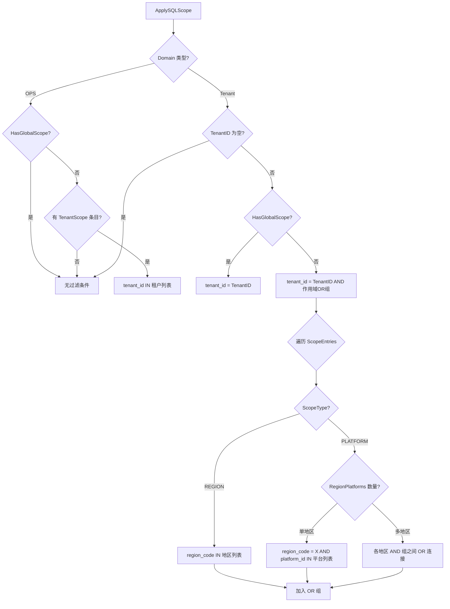
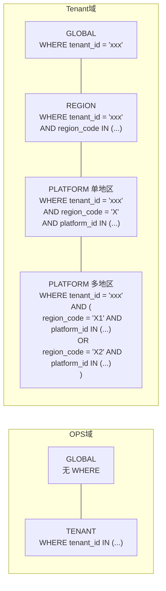
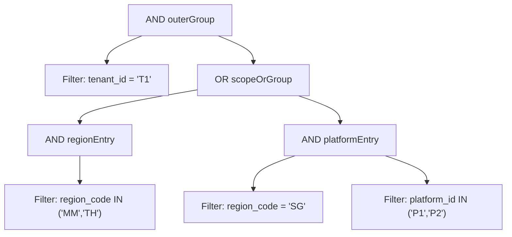

## 作用域层级表

### OPS 域（Domain=OPS）

| 角色 | ScopeType | ctx 中的值 | ScopeBindings 数据 | 生成的 SQL 条件 |
|------|-----------|-----------|-------------------|----------------|
| Ops 全局管理员 | GLOBAL | Domain=OPS, TenantID="" | scope_type=GLOBAL, tenant_ids=[] | 无（不加任何过滤） |
| Ops 租户管理员 | TENANT | Domain=OPS, TenantID="" | scope_type=TENANT, tenant_ids=["T1","T2"] | tenant_id IN ('T1','T2') |

### Tenant 域（Domain=TENANT）

| 角色 | ScopeType | ctx 中的值 | ScopeBindings 数据 | 生成的 SQL 条件 |
|------|-----------|-----------|-------------------|----------------|
| Tenant Owner | GLOBAL | Domain=TENANT, TenantID="T1", IsOwner=true | scope_type=GLOBAL, region_codes=[], platform_ids=[] | tenant_id = 'T1' |
| Tenant 全局用户 | GLOBAL | Domain=TENANT, TenantID="T1" | scope_type=GLOBAL, region_codes=[], platform_ids=[] | tenant_id = 'T1' |
| Tenant 地区级 | REGION | Domain=TENANT, TenantID="T1" | scope_type=REGION, region_codes=["MM","TH"], platform_ids=[] | tenant_id = 'T1' AND region_code IN ('MM','TH') |
| Tenant 平台级（单地区） | PLATFORM | Domain=TENANT, TenantID="T1" | scope_type=PLATFORM, region_platforms=[{region_code:"MM", platform_ids:["P1","P2"]}] | tenant_id = 'T1' AND region_code = 'MM' AND platform_id IN ('P1','P2') |
| Tenant 平台级（多地区混合） | REGION + PLATFORM | Domain=TENANT, TenantID="T1" | Entry1: scope_type=REGION, region_codes=["MM","TH"]<br>Entry2: scope_type=PLATFORM, region_platforms=[{region_code:"SG", platform_ids:["P1","P2"]}] | tenant_id = 'T1' AND (region_code IN ('MM','TH') OR (region_code = 'SG' AND platform_id IN ('P1','P2'))) |

### 关键区别

| 对比项 | OPS 的 * | Tenant 的 * |
|--------|----------|-------------|
| 含义 | 跨所有租户，不加 tenant_id 过滤 | 本租户下所有地区和平台，只加 tenant_id |
| SQL 影响 | 无 WHERE 条件 | WHERE tenant_id = 'xxx' |
| 数据范围 | 全局 | 租户内全局 |

### 作用域决策流程



### SQL 条件生成结构



### FilterGroup 嵌套结构（多地区混合示例）



### 性能说明

#### `=` vs `IN` 选择策略

本模块通过 `addValueFilter` 自动选择操作符：

| 值数量 | 操作符 | 示例 | 性能影响 |
|--------|--------|------|----------|
| 1 个 | `=` | `region_code = 'MM'` | 精确匹配，索引最优 |
| 多个 | `IN` | `region_code IN ('MM','TH')` | 小列表（≤10）与多个 `OR =` 等价，优化器处理方式相同 |

#### 为什么多地区用 `IN` 而不是拆成 `= OR`？

| 维度 | `IN` | `= OR =` |
|------|------|----------|
| 执行计划 | MySQL/PostgreSQL 对小列表 IN 直接转为等值匹配 | 等价，优化器处理方式相同 |
| 索引命中 | 正常走索引 | 正常走索引 |
| 解析开销 | 一次性解析 | 每个 OR 子句独立解析，开销略高 |
| 代码复杂度 | 低，一个 Filter | 高，需构建多个 Filter + OR 组 |
| 大列表风险 | 列表超过 ~200 个值时可能退化 | 同理，OR 过多也会退化 |

> **结论**：地区编码通常 2~5 个值，`IN` 是最优选择。若列表超过 200 个值，建议在业务层分批查询。

#### 单地区优化路径

当 `RegionPlatforms` 只有 1 个地区且 `RegionCodeField` + `PlatformIDField` 都已配置时，走单地区优化路径：

- 直接构建 `AND (region_code = 'X' AND platform_id IN (...))`
- 避免创建多余的 OR 嵌套层，减少 FilterGroup 层级

#### FilterGroup 展平策略

当 `buildPlatformCondition` 返回 OR 组时，`addPlatformEntry` 会将其子组展平到父级 OR 组中，避免 `OR 嵌套 OR` 的冗余结构：

```
展平前：OR [ OR [ AND_MM, AND_SG ] ]    ← 冗余嵌套
展平后：OR [ AND_MM, AND_SG ]            ← 扁平结构
```

这减少了 SQL 生成时的括号嵌套深度，对数据库解析更友好。
